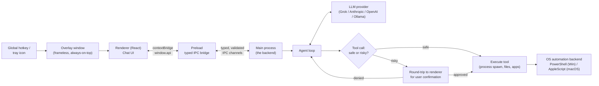

# Nova

**N**ative **O**rchestrator for **V**aried **A**ctions — a tray-resident, hotkey-summonable Electron desktop assistant that doesn't just chat, it acts on the machine: spawning processes, driving OS automation, and controlling other apps via an LLM tool-calling agent loop, gated by a confirmation step for risky actions.

Windows + Apple Silicon macOS only. No separate backend — the Electron main process is the backend; the renderer never touches Node/OS APIs directly, only a narrow typed `contextBridge` preload API.

## How it works



The renderer never touches Node or OS APIs directly — it only calls a narrow, typed `window.api` exposed through the preload's `contextBridge`. Every request crosses main as a validated IPC message and comes back wrapped in a `{ ok, value | error }` result. The agent loop (Phase 1+) turns chat input into LLM tool calls; any tool tagged `risky` must round-trip to the renderer for explicit user approval before it's allowed to touch the OS.

Right now the shell is what's built — tray, hotkey, overlay window, and the hardened IPC bridge — while `chat:send` just echoes input back to prove the round-trip. No LLM, tools, or automation are wired up yet.

## Recommended IDE Setup

- [VSCode](https://code.visualstudio.com/) + [ESLint](https://marketplace.visualstudio.com/items?itemName=dbaeumer.vscode-eslint) + [Prettier](https://marketplace.visualstudio.com/items?itemName=esbenp.prettier-vscode)

## Project Setup

### Install

```bash
$ npm install
```

### Development

```bash
$ npm run dev
```

Toggle the window with `Ctrl+Shift+Space` (Windows/Linux accelerator syntax; same binding on macOS), or via the tray icon.

### Other commands

```bash
$ npm run lint          # ESLint
$ npm run format:check  # Prettier check (npm run format to write)
$ npm run typecheck     # TypeScript (node + web projects)
$ npm run test          # Vitest — single test: npx vitest run <path>
```

### Build

```bash
$ npm run build       # typecheck + electron-vite build

# Packaged installer
$ npm run build:win   # Windows
$ npm run build:mac   # macOS (Apple Silicon)
```
